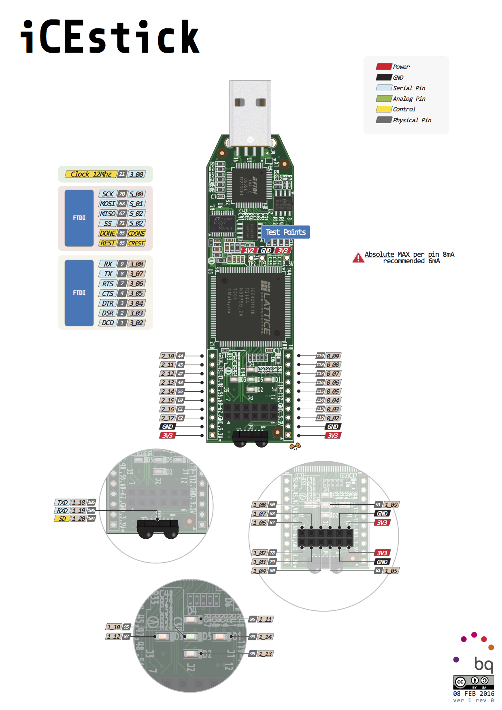

# Lattice iCEstick evaluation board


## setup

https://github.com/FPGAwars/apio/wiki/Quick-start

### 1. apio

create new python virtual environment and install apio there.

```shell
virtualenv ~/fpgaenv
source ~/fpgaenv/bin/activate
pip install -U apio
```

### 2. install all the available apio packages

```shell
(fpgaenv) [fahmad@ryzen fpga-icestick]$  which apio
~/fpgaenv/bin/apio
(fpgaenv) [fahmad@ryzen fpga-icestick]$  apio --version
```

### 3. enable ftdi

```shell
apio drivers --ftdi-enable
```

list

```shell
(fpgaenv) [fahmad@ryzen fpga-icestick]$ apio system --lsftdi
Number of FTDI devices found: 1
Checking device: 0
Manufacturer: FTDI, Description: Dual RS232-HS
```

### 4. examples

```shell
apio examples -l
apio examples -d icestick/leds
```

list supported boards and create `apio.ini`

```shell
apio boards --list
apio init --board icestick
```

verify

```shell
apio verify
```

simulate

```shell
sudo dnf install gtkwave
apio sim
```

build

```shell
apio build
```

upload

```shell
apio upload
```

### error uploading the program

thanks to `Fabian Zachs` on youtube comment section

> Hi, I had the same issue. When you do `apio system --lsftdi`, the description doesnt match whats in the video/what apio expects. So to fix this, you need to find the apio/resources/boards.json file and change the description in there. To find this, i did: `pip3 show apio`. That gives you the "location" of apio. `cd` there and run `find . -name "boards.json"`. Edit the file's "icestick" description entry. Change it from "Lattice FTUSB Interface Cable" to "Dual RS232-HS". Then retry `apio upload`

# References

- https://www.youtube.com/playlist?list=PLEBQazB0HUyT1WmMONxRZn9NmQ_9CIKhb
- https://yosyshq.net/yosys/about.html
- https://wiki.archlinux.org/title/Python/Virtual_environment
- https://appcodelabs.com/getting-started-with-lattice-icestick-using-open-source-tools-on-macos-linux

## pinout


